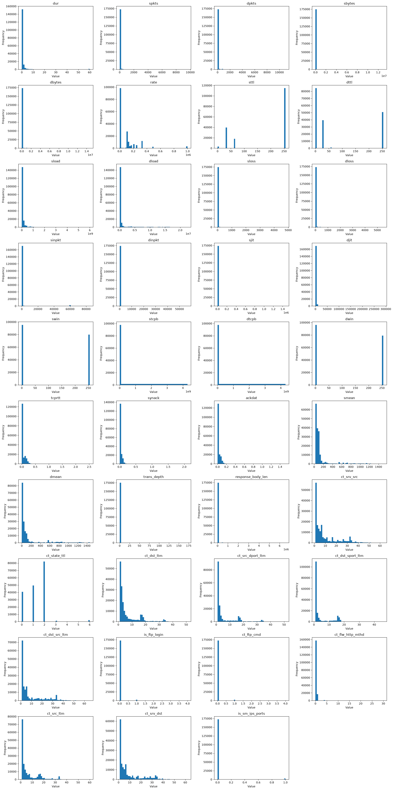
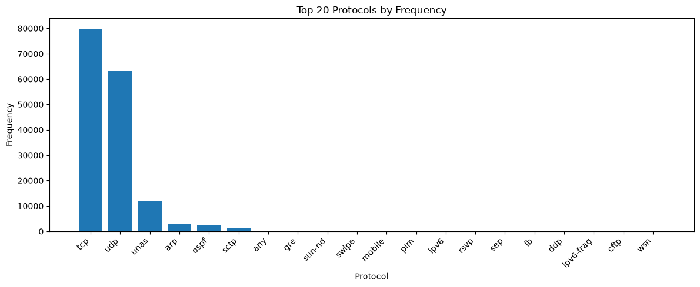
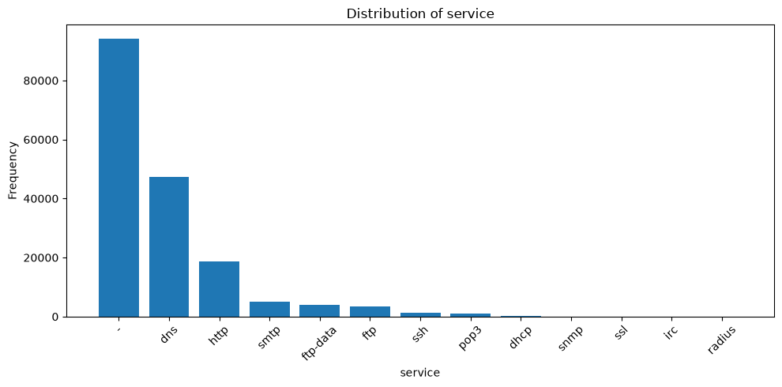
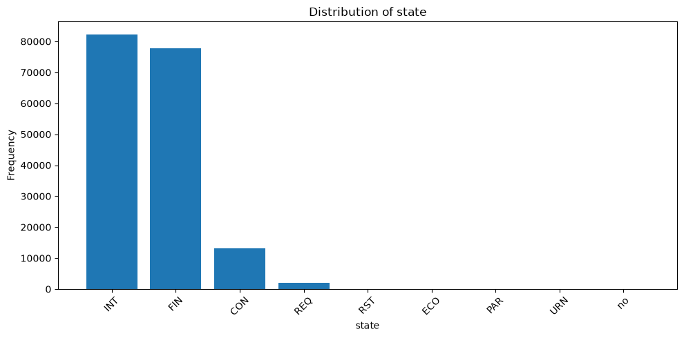
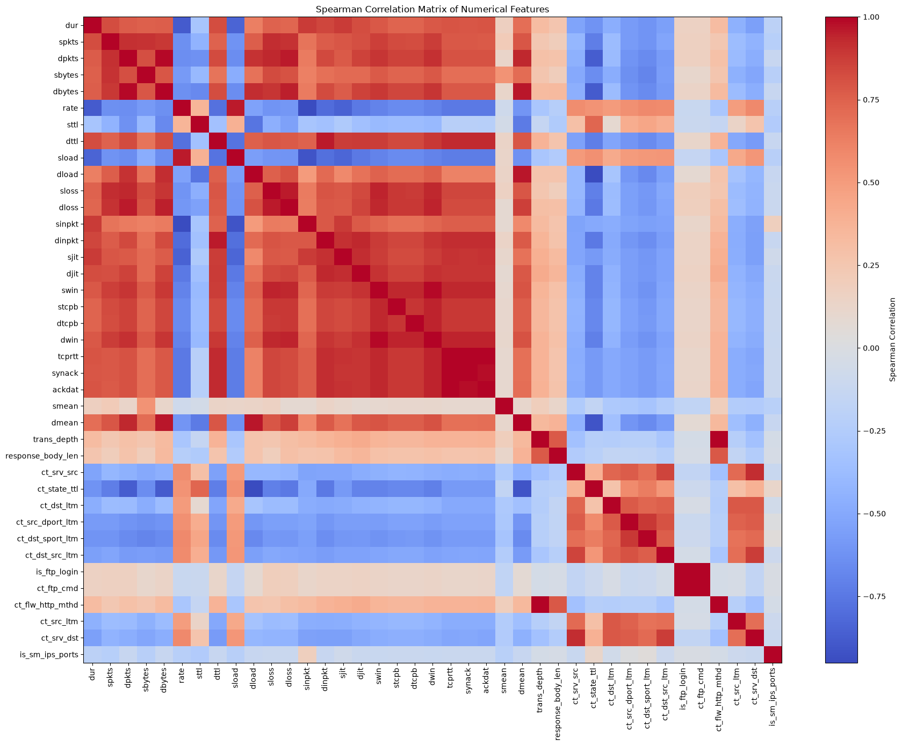
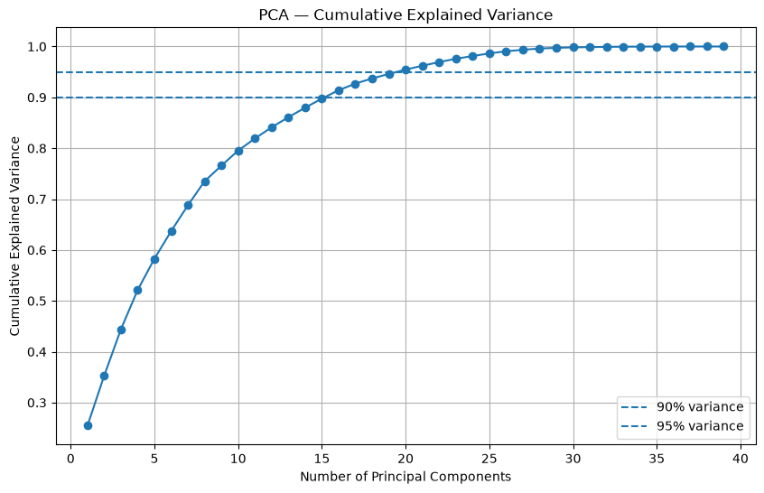
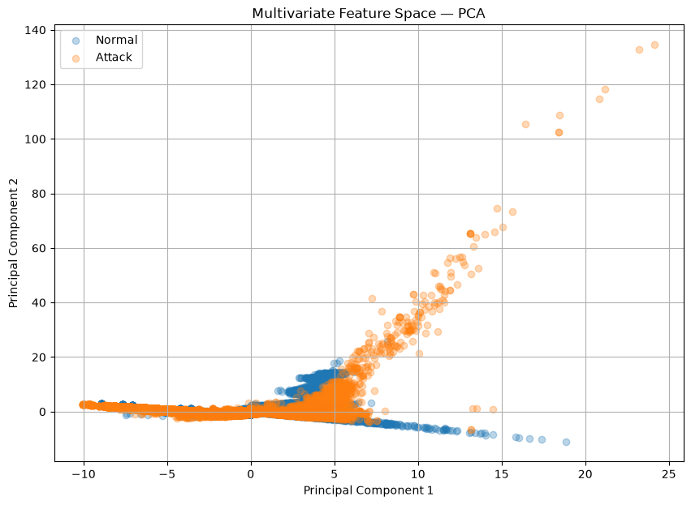
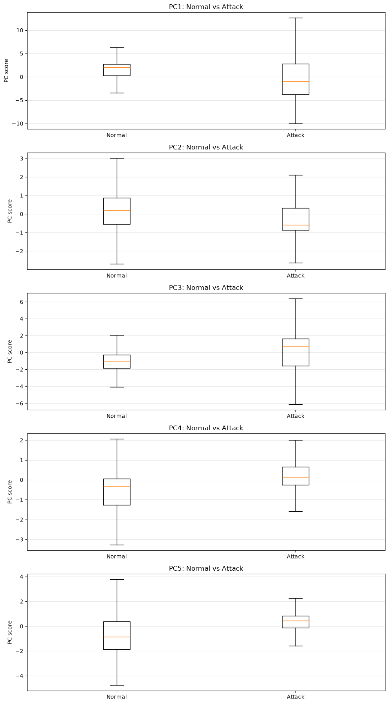
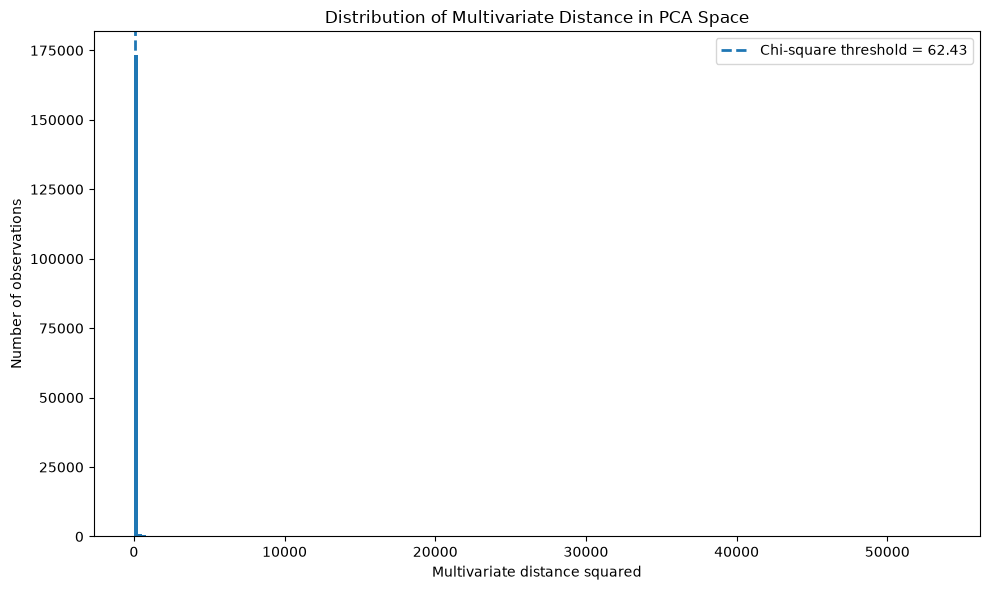

# NetGuard ML — Exploratory Data Analysis Report

## 1. Executive Summary

The executed EDA analyzes a 175,341-row, 45-column UNSW-NB15 development table and an 82,332-row, 45-column comparison table. The notebook assigns the larger file to `train_df`, although it is read from `UNSW_NB15_testing-set.csv`; this naming inversion is documented in the notebook-quality audit and must be handled consistently in model development.

The binary target contains 119,341 Attack records (68.06%) and 56,000 Normal records (31.94%), a moderate 2.13:1 imbalance. There are no missing values, exact full-row duplicates, negative numerical values, or constant columns. However, 74,301 rows are repetitions beyond the first occurrence of a 42-feature pattern, and 229 identical predictor patterns have conflicting labels, involving 940 rows (0.54%). Many variables are structurally zero-heavy and strongly right-skewed; zero is often a meaningful network state rather than missingness.

Normal and Attack traffic differ materially on several numerical variables. The largest absolute rank-biserial effects are `sttl` (0.7629), `ct_state_ttl` (0.7412), `dload` (0.7306), `dmean` (0.6376), `dbytes` (0.5734), and `dpkts` (0.5658). All 39 numerical tests are statistically significant, but the very large sample makes p-values unsuitable as feature-importance rankings.

Categorical attack rates also vary substantially. Among well-represented services, SSH has a 0.84% attack rate, POP3 99.64%, DNS 84.16%, and HTTP 71.44%. State INT has a 93.05% attack rate, compared with FIN at 52.23% and CON at 8.01%. Several rare categories reach 100%, but small denominators require caution and strong association is not automatically leakage.

Correlation analysis identifies substantial redundancy among packet/byte/loss features, TCP timing features, window sizes, FTP indicators, and contextual count features. These relationships support later controlled feature-selection experiments, not immediate deletion.

PCA on all 39 standardized numerical features shows genuinely high-dimensional structure: PC1 explains 25.45%, PC1–PC2 35.28%, the first 5 components 58.28%, and the first 15 components 89.75%. PC5 separates the classes more strongly than PC1 by rank-biserial magnitude (0.5397 versus 0.3747), demonstrating that explained variance is not predictive importance. PCA is informative for EDA but is not automatically required in the production pipeline.

Using a rounded chi-square threshold of 62.43 across all 39 PCA dimensions flags 17,336 records (9.89%). Normal traffic has a higher within-class flag rate (16.99%) than Attack traffic (6.56%), and the flagged population is 54.87% Normal. Thus, multivariate unusualness is neither an attack label nor proof of bad data. The 20 most extreme inspected records are all attacks—12 Exploits, 7 DoS, and 1 Generic—but this small extreme tail must not be generalized to all flagged records.

`id` is a unique row identifier and `attack_cat` perfectly discloses Normal-versus-Attack membership. Both are excluded from binary predictors; `label` is the target. The validated initial matrix contains 42 predictors—39 numerical and `proto`, `service`, `state`—with `X_model.shape == (175341, 42)` and `y_model.shape == (175341,)`.

## 2. Dataset and Problem Definition

NetGuard ML treats each row as a network flow/connection record described by protocol, service, connection state, duration, packet and byte counts, load, TTL, timing, TCP, and contextual connection-count variables. The task is binary intrusion detection:

- `label = 0`: Normal traffic;
- `label = 1`: Attack traffic.

False negatives represent attacks predicted as Normal and are particularly relevant operationally. Accuracy alone is therefore insufficient; later evaluation should include class-specific precision, recall, F1, confusion counts, PR-AUC/ROC-AUC as appropriate, and threshold behavior.

## 3. EDA Objectives

The EDA was designed to establish data integrity, target composition, individual numerical and categorical behavior, Normal-versus-Attack differences, feature relationships and redundancy, joint numerical structure, unusual observations, leakage risks, and readiness for modeling. It intentionally stops before model training and final feature selection.

## 4. Dataset Structure

| Role in notebook | Source loaded | Shape | Columns | Evidence |
|---|---|---:|---:|---|
| `train_df` | `../data/raw/UNSW_NB15_testing-set.csv` | 175,341 × 45 | 45 | Cells 2, 93, 100 |
| `test_df` | `../data/raw/UNSW_NB15_training-set.csv` | 82,332 × 45 | 45 | Cells 2, 93 |

The source filenames and notebook roles are reversed relative to their names. The executed EDA is internally based on `train_df` with 175,341 rows, as required by the project context, but this convention must be made explicit before final external evaluation.

The 45 columns comprise `id`, 39 numerical candidate predictors, 3 categorical candidate predictors (`proto`, `service`, `state`), `attack_cat`, and `label`. The schema audit reports no missing values. `proto`, `service`, and `state` have 133, 13, and 9 observed categories in `train_df`; `attack_cat` has 10 categories and `label` has two values.

Both loaded tables support the same 42-column feature selection used in the overlap analysis, but the notebook does not print a complete train-versus-test dtype comparison. Full dtype and category-level compatibility is therefore not verified.

## 5. Data Quality Assessment

| Finding | Evidence | Interpretation | Modeling implication |
|---|---|---|---|
| No missing values | All 45 schema missing counts are zero (cell 3) | No current NA imputation requirement is demonstrated | Pipelines should still handle unexpected missing values safely |
| No exact full-row duplicates | 0 rows, 0.00% (cell 14) | Every complete row differs when `id`, targets, and predictors are included | No full-row deduplication is justified |
| Repeated predictor patterns | `duplicated(subset=42 predictors)` returns 74,301, or 42.38% (cell 16) | This is the count of repeated occurrences beyond each first occurrence, not the total number of rows belonging to duplicate groups | Retain initially; consider grouped diagnostics and split leakage risk |
| Conflicting predictor patterns | 229 feature patterns; 940 rows, 0.54% (cells 17–19) | Identical available predictors sometimes map to both labels, imposing local ambiguity/noise | Inspect errors on these patterns; do not delete automatically |
| No negative numerical values | Empty negative-count result across numeric columns (cell 22) | No negative-value violation was observed | No correction supported |
| Zero-heavy features | `is_ftp_login` and `ct_ftp_cmd` 98.54%; `is_sm_ips_ports` 98.42%; `response_body_len` 93.56%; `trans_depth` and `ct_flw_http_mthd` 89.83% (cell 24) | Zeros frequently encode absence/non-applicability, not missingness | Preserve zeros and features initially |
| Class-dependent zero rates | `ct_state_ttl`: 71.26% Normal vs 0.74% Attack; `dpkts`, `dbytes`, `dmean`: 11.89% vs 65.05% (cell 26) | Zero patterns contain substantial class association | Do not remove sparse features solely for zero prevalence |
| No constant columns | Empty constant-column list (cell 100) | Every column varies in `train_df` | No constant-column removal required |
| High cardinality | Only `id` has unique ratio 1.0 under the notebook's extreme-cardinality rule (cell 100) | Confirms row-key behavior | Exclude `id` from predictors |
| Low feature-pattern overlap | 1,302 of 53,946 unique comparison-table patterns occur among 101,040 unique development patterns: 2.41% (cell 28) | No widespread exact pattern reuse is visible | This does not independently prove absence of leakage or distribution shift |

The data-quality evidence supports retention rather than wholesale deletion. The conflicting-label patterns are especially important for later error analysis because a deterministic classifier using only these predictors cannot assign different labels to identical rows.

## 6. Target and Attack Category Analysis

| Class | Count | Percentage |
|---|---:|---:|
| Normal (`label=0`) | 56,000 | 31.94% |
| Attack (`label=1`) | 119,341 | 68.06% |

This is a meaningful but not extreme imbalance: Attack is about 2.13 times Normal. Stratification and class-specific metrics are appropriate; imbalance is not a reason to remove observations.

Among attacks, Generic contributes 40,000 (33.52%), Exploits 33,393 (27.98%), Fuzzers 18,184 (15.24%), DoS 12,264 (10.28%), Reconnaissance 10,491 (8.79%), Analysis 2,000 (1.68%), Backdoor 1,746 (1.46%), Shellcode 1,133 (0.95%), and Worms 130 (0.11%). The long tail means good binary performance may conceal weak performance on rare attack types.

The `label`–`attack_cat` cross-tabulation is deterministic: every Normal label has category Normal and every Attack label has a named attack category. `attack_cat` is therefore valid for EDA and post-hoc error slicing but confirmed leakage as a binary-model input.

No target-distribution or attack-category figure was generated by the executed notebook, so none was fabricated for this report.

## 7. Numerical Feature Analysis

The 39 numerical candidates span very different units and scales. Medians are especially useful because many distributions are extremely right-skewed: `sbytes` has median 430, mean 8,844.844, maximum 12,965,250, and skewness 45.303; `dbytes` has median 164, mean 14,928.92, maximum 14,655,550, and skewness 39.761. Packet counts show similar heavy tails (`spkts` skewness 40.218; `dpkts` 36.764).

Timing/load variables are also highly asymmetric. `dur` has median 0.002 versus mean 1.359 and maximum 60; `sload` has median 879,674.75 versus mean 73.45 million and maximum 5.988 billion; `dload` has median 1,447.02 versus mean 671,205.6 and maximum 22.42 million. Jitter and inter-packet variables have large zero masses and long tails (`sjit` skewness 17.652; `djit` 29.544; `dinpkt` 29.680).

Some variables are discrete/multimodal rather than conventionally continuous. `sttl` is concentrated mainly at 254, 31, and 62; `dttl` mainly at 0, 252, and 29. TCP windows are heavily concentrated at 0 and 255. These modes are meaningful structure, not evidence of corruption.

*Figure 1. Fresh cell-43 output showing all 39 numerical candidate distributions. Common-scale histograms expose zero concentration, bounded/discrete variables, and extreme right tails; for several variables the long range compresses most observations near zero.*

**Modeling implication:** scale-sensitive algorithms require training-only scaling, while skew-aware transformations may be tested later as feature-engineering hypotheses. No transformation is mandated by EDA.

## 8. Categorical Feature Analysis

`proto` is dominated by TCP (79,946) and UDP (63,283), followed by `unas` (12,084), ARP (2,859), and OSPF (2,595). Attack rates differ: TCP 51.07%, UDP 78.00%, `unas` 100%, ARP 0%, and OSPF 97.53%. Many other protocols have roughly 98–100 observations and 100% observed attack rates, so denominator size is essential.

*Figure 2. Cell-47 output for the 20 most frequent protocols. The distribution is concentrated in TCP and UDP; the figure reports frequency, not attack rate.*

Service is dominated by `-` (94,168), DNS (47,294), and HTTP (18,724). Their attack rates are 61.23%, 84.16%, and 71.44%. POP3 is 99.64% Attack across 1,105 rows, while SSH is only 0.84% Attack across 1,302 rows. DHCP, SSL, and IRC each show 100% in samples of only 94, 56, and 25.

*Figure 3. Cell-45 service count plot. The large `-` category requires an explicit semantic check during preprocessing; it should not silently be treated as missing without evidence.*

State is dominated by INT (82,275; 93.05% Attack) and FIN (77,825; 52.23%), with CON (13,152; 8.01%) and REQ (1,991; 53.54%) forming the next largest groups. RST has 83 rows and 14.46%; categories with one or twelve records cannot support stable rate conclusions.

*Figure 4. Cell-45 state count plot. INT and FIN dominate; very rare states must be handled safely by categorical encoders.*

Strong category association is legitimate predictive signal when the category is an actual inference-time network attribute. It becomes leakage only if derived from the answer or unavailable at prediction time.

## 9. Normal vs Attack Feature Analysis

Class medians show broad structural differences. Normal versus Attack medians include: `spkts` 12 versus 2, `dpkts` 10 versus 0, `sbytes` 1,470 versus 200, `dbytes` 1,112 versus 0, `sttl` 31 versus 254, `dload` 336,120.6 versus 0, `swin`/`dwin` 255 versus 0, and `ct_state_ttl` 0 versus 2. Means do not always follow medians because extreme tails matter; for example, Attack `sbytes` has the higher mean despite the lower median.

The two-sided Mann–Whitney U tests find p-values below 0.05 for all 39 numerical variables. A p-value measures evidence of a distributional difference under the test; it is not the magnitude or model value of that difference. With 175,341 observations, tiny differences can be highly significant.

Rank-biserial effect size measures separation magnitude and direction. The strongest absolute results are:

| Feature | Signed effect | Absolute effect |
|---|---:|---:|
| `sttl` | -0.762875 | 0.762875 |
| `ct_state_ttl` | -0.741220 | 0.741220 |
| `dload` | 0.730593 | 0.730593 |
| `dmean` | 0.637597 | 0.637597 |
| `dbytes` | 0.573444 | 0.573444 |
| `dpkts` | 0.565770 | 0.565770 |
| `ct_dst_sport_ltm` | -0.462412 | 0.462412 |
| `dloss` | 0.438031 | 0.438031 |
| `sloss` | 0.429952 | 0.429952 |
| `sbytes` | 0.413370 | 0.413370 |
| `spkts` | 0.411718 | 0.411718 |

`is_ftp_login` and `ct_ftp_cmd`, by contrast, each have absolute effect 0.003386 despite significant p-values. These results support useful candidate signal but do not establish final model importance or causality.

## 10. Correlation and Redundancy Analysis

The heatmap uses Spearman correlation, which measures monotonic association and is appropriate for skewed variables. The subsequent pair tables overwrite `corr_matrix` with Pandas' default Pearson correlation. This method change is not clearly labeled in the notebook and is documented as a quality issue.

*Figure 5. Cell-65 Spearman heatmap across the 39 numerical candidates. Blocks of strong association indicate shared traffic-count, TCP, and contextual structure.*

The Pearson table finds 30 pairs with absolute correlation at least 0.80. A stricter 0.90 analysis retains 16 pairs and yields eight connected groups:

- `dbytes` / `dloss` / `dpkts` (e.g., `dbytes`–`dloss` 0.9965);
- `sbytes` / `sloss` / `spkts` (`sbytes`–`sloss` 0.9961);
- `tcprtt` / `synack` / `ackdat` (`tcprtt`–`synack` 0.9495);
- `dwin` / `swin` (0.9901);
- `ct_srv_src` / `ct_srv_dst` / `ct_dst_src_ltm` (0.9671–0.9803 within the strict group);
- `ct_dst_ltm` / `ct_src_dport_ltm` / `ct_dst_sport_ltm` (including 0.9621 and 0.9068);
- `is_ftp_login` / `ct_ftp_cmd` (1.0000); and
- `sinpkt` / `is_sm_ips_ports` (0.9413).

The notebook's “DROP CANDIDATE” strings compare correlated variables using univariate absolute effects. These are feature-selection hypotheses only. Correlated features can still interact differently with a model or carry useful non-linear information; removal must be tested against an unchanged validation protocol.

## 11. Multivariate Analysis

### 11.1 Why Multivariate Analysis Was Performed

Univariate analysis studies one feature; bivariate analysis studies a two-variable relationship; multivariate analysis studies the joint behavior of many variables. Network flows can be ordinary on every individual measurement yet unusual in their joint combination. Multivariate EDA therefore complements, rather than replaces, the preceding analyses.

### 11.2 PCA Explained Variance

The notebook standardizes all 39 numerical candidates with `StandardScaler`, then fits unconstrained PCA to the 175,341-row EDA table, producing 39 components. A principal component is an orthogonal weighted linear combination of the original standardized variables.

| Components included | Cumulative explained variance |
|---|---:|
| PC1 | 25.4466% |
| PC1–PC2 | 35.2849% |
| First 5 | 58.2836% |
| First 8 | 73.5311% |
| First 10 | 79.5393% |
| First 12 | 84.1166% |
| First 15 | 89.7505% |

*Figure 6. Cell-72 cumulative variance curve. Variation is distributed across many directions; 15 components remain just below 90%.*

Explained variance measures representation of overall numerical feature-space variation. It is not original-feature importance, target importance, or evidence that PCA should be used in the final model.

### 11.3 PC1-PC2 Structure

*Figure 7. Cell-73 projection of standardized numerical data. Normal and Attack points overlap heavily in the central region, while several extended branches and high-PC2 extremes are attack-heavy. The geometry is structured rather than a pair of cleanly separated clusters.*

PC1 and PC2 contain only 35.28% of total numerical variance. Their overlap proves neither inseparability in the original 39-dimensional space nor poor supervised predictability.

### 11.4 PCA Loadings

Large absolute loadings identify variables contributing strongly to a variance direction:

- **PC1:** `dwin` 0.2676, `swin` 0.2650, `ct_dst_src_ltm` 0.2625, `ct_srv_dst` 0.2585, `ct_srv_src` 0.2556, other contextual counts, and `dttl` 0.2272.
- **PC2:** `dpkts` 0.4436, `dloss` 0.4145, `dbytes` 0.4134, followed by `spkts` 0.2783, `dmean` 0.2659, and `response_body_len` 0.2347.
- **PC3:** `tcprtt` 0.3220, `synack` 0.3048, `ackdat` 0.3041, `dttl` 0.2770, and contextual counts.
- **PC4:** `sbytes` 0.4902, `sloss` 0.4831, `spkts` 0.4398, and `smean` 0.2153.
- **PC5:** `dbytes` 0.3114, `dloss` 0.2981, `ct_state_ttl` 0.2962, `sttl` 0.2870, `dload` 0.2866, and `dpkts` 0.2379.

Loadings describe construction of a component. They are not supervised predictive importance.

### 11.5 PCA Normal-vs-Attack Separation

| Component | Absolute rank-biserial effect |
|---|---:|
| PC5 | 0.539690 |
| PC4 | 0.459359 |
| PC1 | 0.374737 |
| PC3 | 0.327319 |
| PC2 | 0.313510 |

*Figure 8. Cell-77 boxplots for PC1–PC5 with plotted outliers suppressed for readability. Central score distributions differ but overlap.*

PC5 provides stronger rank separation than PC1 even though PC1 explains substantially more total variance. This directly demonstrates that variance importance is not classification importance.

### 11.6 Correlation Groups and PCA

Mean absolute loading by correlated group identifies shared multivariate directions:

| Correlated group | Strongest PC | Mean absolute loading |
|---|---|---:|
| `sbytes`, `sloss`, `spkts` | PC4 | 0.471016 |
| `dbytes`, `dloss`, `dpkts` | PC2 | 0.423852 |
| `ackdat`, `synack`, `tcprtt` | PC3 | 0.310310 |
| `dwin`, `swin` | PC1 | 0.266291 |
| `ct_dst_src_ltm`, `ct_srv_dst`, `ct_srv_src` | PC1 | 0.258890 |
| `ct_dst_ltm`, `ct_dst_sport_ltm`, `ct_src_dport_ltm` | PC1 | 0.250596 |

This corroborates that highly correlated groups participate in common variance structures. It does not identify which original variable a supervised model should retain.

## 12. Multivariate Outlier Analysis

The notebook uses all 39 standardized PCA scores. It estimates each component's sample variance and sums squared PC scores divided by those variances. Because PCA components are orthogonal, this is a diagonal-covariance Mahalanobis-style squared distance in the full PCA coordinate system. It compares distances with the 99th-percentile chi-square cutoff for 39 dimensions (displayed as 62.43).

The final class analysis uses a hard-coded rounded cutoff of exactly 62.43 and reports:

| Class | Regular | Outlier | Within-class outlier rate |
|---|---:|---:|---:|
| Normal | 46,487 | 9,513 | 16.99% |
| Attack | 111,518 | 7,823 | 6.56% |
| **Total** | **158,005** | **17,336** | **9.89% overall** |

The outlier population is 54.87% Normal and 45.13% Attack. A preceding cell uses the unrounded `chi2.ppf` value and flags 17,337—one additional record. This is a threshold-rounding inconsistency, not a substantive change in the overall interpretation.

*Figure 9. Cell-83 histogram with the 62.43 cutoff. The extremely long right tail compresses the central mass; the 90th percentile is 61.88, 95th 85.17, 99th 315.96, and 99.9th 2,770.99.*

The chi-square calibration is questionable because it is exact under multivariate-normal/elliptical assumptions, whereas the original variables are strongly skewed, zero-heavy, discrete, and heavy-tailed. The observed 9.89% flag rate at a nominal 1% cutoff reinforces that the threshold is functioning as a heuristic unusualness screen rather than a calibrated error probability.

Multivariate outlier does not mean Attack and does not mean bad record. No deletion is justified.

## 13. Extreme Observation Investigation

Among the 20 most extreme observations inspected, all 20 are labelled Attack: 12 Exploits, 7 DoS, and 1 Generic. The table includes TCP/HTTP/FIN, UDP/DNS/CON, and TCP/POP3 FIN/CON examples. Some flows have very large destination traffic (up to 10,974 `dpkts` and 14,655,550 `dbytes` in the displayed rows), long durations near 60 seconds, or unusual combinations of byte counts, sequence values, load, loss, jitter, and timing.

The median-difference table ranks `dtcpb`, `stcpb`, `dbytes`, `sload`, `dload`, `sbytes`, packet/loss counts, jitter, TTL, and duration among the largest raw-scale differences. Raw absolute differences are scale-dependent and should not be interpreted as importance.

`id` also appears in that table because cell 99 selects every numeric column except `label`. This is an analysis artifact: `id` is not part of the PCA inputs and has no network-behavior meaning.

The top 20 result applies only to the inspected extreme tail. It does not contradict the full flagged population, which contains more Normal than Attack records, and it does not justify deletion.

## 14. Leakage and Identifier Audit

| Column | Evidence | Decision |
|---|---|---|
| `id` | 175,341 unique values across 175,341 rows; sequential range 1–175,341; IDs overlap completely with the comparison file's 1–82,332 range | Exclude from predictors |
| `label` | Binary outcome with values 0 and 1 | Use as `y`; exclude from `X` |
| `attack_cat` | Perfect cross-tabulation: Normal iff label 0; named attack category iff label 1 | Confirmed target leakage for binary input; retain only for EDA/error slicing |
| Other 42 candidates | No direct target construction demonstrated | Retain initially, subject to deployment-time availability and later validation |

The auxiliary exact-value screen finds no candidate that directly equals `label`; its highest fraction-equal result is only 0.4594 for `ct_state_ttl`. Strong association in `proto`, `service`, `state`, TTL, load, or count measurements is not itself leakage.

## 15. Final Initial Feature Set

| Item | Verified result |
|---|---:|
| Original columns | 45 |
| Excluded from `X` | `id`, `attack_cat`, `label` |
| Initial predictors | 42 |
| Numerical predictors | 39 |
| Categorical predictors | 3: `proto`, `service`, `state` |
| Target | `train_df["label"]` |
| `X_model` shape | (175341, 42) |
| `y_model` shape | (175341,) |

This is an initial modeling set, not a completed feature-selection result.

## 16. Major EDA Conclusions

1. The development table contains 175,341 flows and 45 columns; the source filename/role convention is inverted and must remain explicit.
2. Attack is the majority class at 68.06%, creating moderate imbalance without requiring row removal.
3. Missingness, exact full-row duplicates, negatives, and constants are absent, but repeated predictor patterns are common and 940 rows participate in label-conflicting patterns.
4. Numerical variables differ by orders of magnitude and are commonly zero-heavy and right-skewed; medians are more representative than means for many features.
5. TTL, destination load/size/packet behavior, and contextual state counts show the strongest univariate class separation by rank-biserial magnitude.
6. Protocol, service, and state contain substantial class signal, but rates for rare categories are unstable.
7. Several numerical groups are highly redundant, especially packet/byte/loss, TCP timing, window, FTP, and contextual-count groups.
8. PCA reveals distributed high-dimensional variance rather than a low-dimensional two-cluster solution.
9. PC5 separates classes more strongly than PC1 despite explaining less overall variance.
10. The outlier heuristic flags both classes and flags Normal at a higher within-class rate; unusualness is not the target.
11. The most extreme 20 inspected rows are genuine labelled attacks in three categories, so blind outlier removal would discard relevant events.
12. `id` and `attack_cat` are excluded for identifier/leakage reasons; the initial set contains all 42 legitimate candidates.

## 17. Modeling Implications

The next phase should:

1. define the development/validation/final-test strategy and resolve the source-file naming convention;
2. split before fitting learned preprocessing, using stratification unless grouped/temporal leakage analysis indicates a stronger strategy;
3. build a pipeline with safe encoding for `proto`, `service`, and `state`, including unseen categories;
4. scale numerical variables only where the model requires it;
5. establish a baseline with all 42 legitimate candidate predictors;
6. evaluate attack precision, recall, F1, false negatives, false positives, and discrimination metrics appropriate to the use case;
7. perform error analysis, including conflicting feature patterns and attack-category slices;
8. test correlation-based selection and any transformations as controlled experiments against the same validation baseline;
9. use `attack_cat` only after prediction for error slicing; and
10. freeze development decisions before evaluating once on the held-out comparison table.

No model was trained in this task.

## 18. EDA Limitations

- Dataset role names do not match source filenames; the intended final holdout convention needs explicit confirmation.
- Full train/test dtype and category-set consistency is not printed.
- The notebook has count plots but no target, attack-category, or categorical attack-rate plots.
- Linear-scale histograms are dominated by extremes; log/robust views could clarify distributions, but were not added because this audit preserves existing analysis.
- Pair correlation switches from Spearman to Pearson without a clear narrative distinction.
- Duplicate-count wording overstates what Pandas' default `duplicated` count represents.
- Mann–Whitney tests are unadjusted for multiple comparisons, although effect magnitudes, not a p-value cutoff, drive the substantive interpretation.
- PCA and scaling use all `train_df` rows, which is acceptable for descriptive EDA but cannot be reused as fitted preprocessing in model validation.
- PCA is linear and scale-dependent; standardization addresses scale but not skewness or non-Gaussianity.
- The chi-square distance threshold is poorly calibrated for these heavy-tailed/discrete distributions and differs by one record when rounded.
- The 20-row extreme analysis is illustrative, not representative of every flagged record.

## 19. What EDA Does NOT Prove

This EDA does not prove causality, final supervised feature importance, the optimal model, the optimal feature subset, that PCA should be used for training, that correlated variables should be removed, that statistical outliers are erroneous records, that every highly predictive variable is leakage, or that PCA explained variance equals attack-prediction usefulness.

All feature-removal and feature-engineering proposals remain hypotheses to test during model development.
